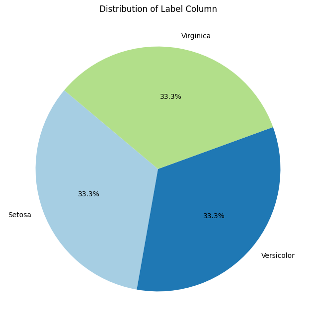

# **IRIS-Data-Science-Project**

The Iris flower data set or Fisher's Iris data set is a multivariate data set introduced by _the British statistician and biologist Ronald Fisher in his 1936_ paper "The use of multiple measurements in taxonomic problems" as an example of linear discriminant analysis. This famous iris data set gives the measurements in centimeters of the variables sepal length and width and petal length and width, respectively, _for 3000 flowers from each of 3 species of iris_. The species are Iris setosa, versicolor, and virginica.

+ The dataset contains a set of 3000 records under 5 attributes :-

1. sepal length in cm
2. sepal width in cm
3. petal length in cm
4. petal width in cm
5. Species: -- Iris Setosa -- Iris Versicolour -- Iris Virginica


# **Libraries Used**

Importing the libaries for this project: Pandas, Numpy, Matplotlib.

**Pandas** is an open source library, easy-to-use data structures and data analysis tools.

**NumPy** is the fundamental package for scientific computing with Python

**Matplotlib** is a Python library for creating static, animated, and interactive visualizations, primarily for data visualization in scientific computing.

**Seaborn** is a Python data visualization library built on Matplotlib that provides a high-level interface for creating attractive and informative statistical graphics.

I also used the **Jupyter Notebook** for this project.

```

import pandas as pd
import numpy as np
import seaborn as sns

```

# **Data Loading**

Import the _**Iris.csv**_ using the pandas library and then We examine first few rows of data.

```

df = pd.read_csv('C:\\Iris_Data_Science_Project\\iris_synthetic_data.csv')

df.head(20)

```

# **Discovering the Shape of the table**

By Using Shape We can find out what the size of rows and columns in the given iris_dataset.

# **Summary Statistics Table**

+ This statistics table is a much nicer, cleaner way to present the data.
+ We can see there is huge range in the size of the Sepal Length and Petal Length.-
+ We will use box plots and scatter plots to see if the size is related to the species of Iris dataset.


# **Checking of Missing Values**

+ If our dataset has no missing values then there is no need of any cleaning methods perform on our given dataset.
+ When our dataset has missing values we have to handle these missing values then we do different steps as given:

1. Replace with NAN
2. Fill the missing values by taking mean.
3. Drop that missing value of column or row.
But the Given iris dataset has no missing values so we don’t need to perform any further cleaning process.

# **Visualizations**

We need to do different visulization which shows our data visualy to us but there are differnet types of visulizations from which few are given:

# **Scatter Plot**

+ Here we can use to variables to show that there is distinct difference in sizes between the species.
+ Firstly, we look at the Sepal width across the species.
+ Is it clear to see that the iris Setosa has a significantly smaller Sepal width across the  species.
+ This difference occurs again for the Sepal width. And in both cases we can see that the Iris Viginica is the largest species.


# **Another Scatter Plot** 

+ Here we can use to variables to show that there is distinct difference in sizes between the species.
+ Firstly, we look at the Petal width across the values of species.
+ Is it clear to see that the iris Setosa has a significantly smaller Petal width across the  species.
+ This difference occurs again for the Petal width. And in both cases we can see that the Iris Viginica is the largest species.


# **Box Plot**

The boxplot is a quick way of visually summarizing one or more groups of numerical data through their quartiles. Comparing the distributions of:

1. Sepal Length
2. Sepal Width
3. Petal Length
4. Petal Width


# **KDE Plot**

KDE (Kernel Density Estimation) is a non-parametric technique for estimating the probability density function (PDF) of a continuous random variable, smoothing data to show its distribution.


# **Histogram**

+ A histogram is a graphical representation of the distribution of a dataset.
+ where data is grouped into bins, and the height of each bar represents the frequency of data points within that bin.


# **Pie Chart**
A pie chart is a circular statistical graphic divided into slices, where each slice represents a proportion of the whole, typically used to show percentage distributions.

This graph shows us the equal presence of given iris speciess.

# **Correlation HeatMap**

A correlation heatmap is a graphical representation of a correlation matrix, where colors indicate the strength and direction of relationships between variables in a dataset.


# **Violin Plot

A voilin plot is used to visualise the distribution of the data and its probability density.

This graph shows us that Iris-Setosa is more compact than the Iris-Verginica and Iris-Versicolor.

# **Pair Plot**

This chart enables us to quickly see the relationships between variables across multiple dimensions usings scatterplots and histograms.


# **Machine Learning using scikit-learn**

Using the Scikit-learn library we can perform machine learning on the dataset. As this is my first step into machine learning I have heavily relied on the tutorials below for help.

# **Scikit-learn**

It is a free machine learning library for python. It features various classification, regression and clustering algorithms. Built on Numpy and Scipy. For this project, I will use different classification algorithms,but I optimized Support Vector Classification (SVC) to perform supervised learning.

As the dataset is already import into scikit-learn, I will reuse it. Here are the steps:

+ Import Data
+ Investigate the Data
+ Perform supervised Learning with K-Nearest-Neighbors (KNN)
+ Fitting the model
+ Predict the response

# **Support Vector Classification**

Support Vector Classification (SVC) is a powerful machine learning algorithm based on Support Vector Machines (SVMs). It is widely used for both binary and multi-class classification problems.

1. In our datset we have different three classes or labels which includes Iris-setosa,Iris-versicolor and Iris-virginica.2. After loading our dataset then we have to split our dataset into train and test dataset with a ratio ofc 80% & 20%.
2. Then after training the model we have to make predictions and then evaluate the accuracy of our model.
After checking the accuracy of our model , We have to made classification report of our model which describe us completely about our model.
3. The accuracy of our model is 0.93.

# **Naive Bayes Classification**

1. We have type of Naive Bayes Classification which is Gussian Naive Bayes(Variables are continous in nature).In our given dataset variables are continous in nature So we use Gussian Naive Bayes in our model.
2. Then we split our dataset into train and test dataset.
3. Now We have to train our model and check the accuracy.
4. The accuracy of our model is 0.93.

# **KNN Classification**

1. KNN is a lazy learning algorithm that classifies a data point based on the majority class of its K nearest neighbors.We can change the value of K according to our given dataset. 
2. After loading our dataset then we have to split our dataset into train and test dataset with a ratio of 80% & 20%. 
3. Then after training the model we have to make predictions and then evaluate the accuracy of our model.
4. The accuracy of our model is 0.93.

# **XGB Classifier**

1. XGBoost is an optimized gradient boosting library that builds trees sequentially, correcting errors at each step.This algorithm handles missing values atomatically.
2. After loading our dataset then we have to split our dataset into train and test dataset with a ratio ofc 80% & 20%.
3. Then after training the model we have to make predictions and then evaluate the accuracy of our model.
4. The accuracy of our model is 0.93.

# **Logistic Regression**

1. Logistic Regression is a linear classification model that predicts probabilities using the sigmoid function. 
2. Despite its name, it is used for classification rather than regression.Uses the sigmoid function to convert it into a probability.
3. The logistic regression model tells us whether it is True or False & Yes or No.
4. Then after loading dataset we have to split data into train and test dataset.
5. After training the model we have to make predictions, then we check the accuracy of our model.
6. The accuracy of our model is 0.93.

# **Decision Tree**

1. A Decision Tree is a flowchart like model that splits data into branches based on feature & conditions, making decisions at each node..
2. After loading our dataset then we have to split our dataset into train and test dataset with a ratio ofc 80% & 20%.
3. Then after training the model we have to make predictions and then evaluate the accuracy of our model.
4. The accuracy of our model is 0.93.

# **Optimization of SVC model**

1. First We have to load our dataset. Then we have to split it into train and test dataset.
2. After Splitting of our dataset,We have to Standardize the features of our model.
3. Then we do Hyperparameter tunning
(The process of choosing the optimal parameter).
4. Now we have to make prediction and then we again evaluate the accuracy of our model.
5. After performing Optimization,hence we have to calculate the accuracy of our model.
6. Best Parameters: {'C': 0.1, 'gamma': 0.1, 'kernel': 'poly'}
Test Accuracy: 1.00.

# **Classification Report**


# **Confusion Matrix**

It is actually the comparison between actual and predicted values.


The rows represent the actual classes in the data.
The columns represent the classes predicted by the model.
The cells in the matrix show the number of instances that were classified into each combination of actual and predicted classes.
The model correctly predicted 10 instances of setosa, 8 instances of versicolor, and 11 instances of class virginica.
The model incorrectly predicted 1 instance of class versicolor as class virginica.There were no other misclassifications.
This matrix shows that the model is performing well, with a high number of correct predictions and only a few misclassifications.

#  **Removing the column**

After doing Classification then We have to Clustering which is unsupervised learning.So We have to remove the Species Column for unlabelled dataset which is used in Clustering for iris-dataset.

# **Clustering**

Clustering is an unsupervised machine learning technique used to group similar data points based on patterns and similarities. Here are some common clustering techniques used in data 
science:
# **Elbow Method For K-Mean Clustering**


+ The elbow appears around k=3 or k=5, where the rate of decrease slows down.
+ This suggests 3 or 5 clusters might be optimal for this dataset.
+ The optimal number of clusters (k) is likely 3 or 5, depending on further validation with Silhouette Score.

# **Silhouette Method For K-Mean Clustering**


+ The peak of the graph (k=2) indicates the optimal number of clusters, where the Silhouette Score is highest (around 0.61).
+ This suggests that dividing the data into two clusters provides the best separation and cohesion among the data points.

# **Optimal Value Of K**

For optimal k-mean value of our dataset is K=3 because we have three labels when we done classification after performing Elbow method and Silhouette method.

# **Cluster Distribution**

There are two types of integer type in our raw dataset for clusttering.

1. int 64
2. int 32

# **Cluster Visulization With PCA**

+ The separation between clusters suggests a clear distinction between groups, possibly from a clustering algorithm like K-Means  Clustering.
+ One cluster (yellow) is well separated on the left, while the other two clusters (green and purple) have some overlap in the center and right.


# **Mean Value For Clusters**

+ **Cluster 0** has medium Sepal & Petal Lengths  ,smallest Sepal width,intermediate Petal Width showing Likely represents Iris Versicolor.
+ **Cluster 1** has largest Sepal & Petal Lengths ,intermediate Sepal width,high Petal Width showing likely represents Iris Virginica.
+ **Cluster 2** has smallest Sepal & Petal Lengths ,widest Sepal width,near-zero Petal Width showing likely represents Iris Setosa.


# **Comparison Between Classification and Clutering**


# **Conclusion**

+ If labels are available then classification is the best approach for high accuracy while on the other hand if labels are not available then clustering provides useful insights.
+ The Iris dataset is well-suited for classification but it create challenges for clustering due to overlapping classes(Versicolor & Virginica).
+ So if we have given label dataset then this is best for us to perform classification rather impliying Clustering.

